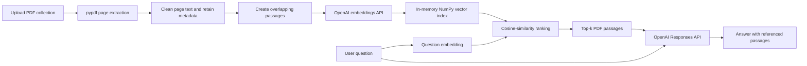

# SourceLens

**Ask focused questions across a collection of PDFs.**

SourceLens is a Streamlit application for exploring multiple PDF documents through a conversational interface. It extracts readable text page by page, splits the text into overlapping passages, generates OpenAI embeddings, stores the vectors in a local in-memory NumPy index, retrieves the passages most relevant to a question, and displays the source document and page number beneath each answer.

## Features

- Upload and index multiple PDF files in one browser session.
- Preserve source filenames and page numbers while processing documents.
- Search document passages with OpenAI embeddings and cosine similarity.
- Generate answers from the retrieved PDF context through the OpenAI Responses API.
- Inspect ranked referenced passages beneath each response.
- Start a new conversation without rebuilding the collection.
- Remove the active collection and clear its in-memory index.
- Handle missing API keys, blank questions, damaged files, encrypted PDFs, blank pages, and image-only scans with clear messages.
- Run automated tests without sending live OpenAI API requests.

## Screenshots

Add local screenshots after running the application. Placeholder filenames are documented in [`docs/screenshots/README.md`](docs/screenshots/README.md).

| Screen | Suggested file |
|---|---|
| Empty state and upload sidebar | `docs/screenshots/collection-upload.png` |
| Indexed document summary | `docs/screenshots/indexed-collection.png` |
| Answer with expanded source passages | `docs/screenshots/answer-with-sources.png` |

## Technology stack

| Technology | Role |
|---|---|
| Python | Application language |
| Streamlit | Browser interface and session state |
| pypdf | PDF page text extraction |
| OpenAI Python SDK | Embeddings API and Responses API calls |
| NumPy | Local vector storage and cosine-similarity ranking |
| python-dotenv | Local environment-variable loading |
| pytest | Automated tests |

## How the application works

1. The user uploads one or more PDF files in the sidebar.
2. SourceLens reads each document with `pypdf` and retains the source filename and page number for every readable page.
3. Page text is cleaned and split into overlapping passages. The overlap helps retain context when an idea crosses a chunk boundary.
4. The application requests an embedding for each passage from the OpenAI embeddings endpoint.
5. Normalized passage vectors are stored in memory as a NumPy matrix.
6. When the user asks a question, SourceLens embeds the question and calculates cosine-similarity scores against the stored passage vectors.
7. The top-ranked passages, the question, and a small amount of recent conversation history are sent to the OpenAI Responses API.
8. The interface shows the answer and an expandable list of referenced passages with filenames and page numbers.



## Local setup on macOS

### Requirements

- macOS with Terminal access.
- Python 3.11 or 3.12 recommended.
- Internet access while installing packages and while using the OpenAI API.
- A valid OpenAI API key with access to the configured models.

### Quick setup

Unzip the project, open Terminal, and move into the extracted folder:

```bash
cd path/to/SourceLens
chmod +x setup_macos.sh run_macos.sh
./setup_macos.sh
```

The setup script creates a virtual environment, installs the runtime and test dependencies, and creates a local `.env` file from `.env.example` when one does not already exist.

### Manual setup alternative

```bash
python3 -m venv .venv
source .venv/bin/activate
python -m pip install --upgrade pip
python -m pip install -r requirements-dev.txt
cp .env.example .env
```

## Environment variables

Open `.env` and replace the placeholder value:

```text
OPENAI_API_KEY=replace_with_your_openai_api_key
```

The remaining values have practical defaults and can usually be left unchanged:

```text
OPENAI_CHAT_MODEL=gpt-4.1-mini
OPENAI_EMBEDDING_MODEL=text-embedding-3-small
SOURCE_LENS_CHUNK_SIZE=1100
SOURCE_LENS_CHUNK_OVERLAP=180
SOURCE_LENS_TOP_K=4
SOURCE_LENS_MAX_HISTORY_MESSAGES=6
SOURCE_LENS_MAX_CONTEXT_CHARS=9000
SOURCE_LENS_EMBEDDING_BATCH_SIZE=64
```

Do not commit `.env`. It is already listed in `.gitignore`.

## Run the app

```bash
./run_macos.sh
```

Or start Streamlit manually:

```bash
source .venv/bin/activate
python -m streamlit run app.py
```

## Use the app

1. Add one or more text-based PDF files in the **PDF Collection** sidebar.
2. Select **Build Document Index**.
3. Confirm that the sidebar lists the indexed document names, readable pages, and searchable passages.
4. Ask a question in the chat input.
5. Expand **Referenced passages** under an answer to inspect the retrieved evidence.
6. Use **Start New Conversation** to clear messages while keeping the active collection.
7. Use **Remove Collection** to discard the in-memory index and uploaded-file selection.

## Testing

Run the automated suite:

```bash
source .venv/bin/activate
pytest -q
```

The tests use fake PDF readers and fake OpenAI clients. They do not consume API credits. A complete manual checklist is available in [`docs/MANUAL_TESTING.md`](docs/MANUAL_TESTING.md).

## Known limitations

- The vector index is held in memory and is discarded when the Streamlit session ends.
- Image-only scanned PDFs require OCR and are reported as non-extractable in this version.
- PDF extraction quality depends on how the original PDF stores text. Complex tables, multi-column layouts, and unusual encodings may produce imperfect passages.
- The app sends document passages to the OpenAI embeddings endpoint and sends retrieved passages with questions to the OpenAI Responses API. Do not upload confidential documents unless that usage is appropriate for your situation.
- Retrieval improves grounding, but generated answers should still be checked against the displayed source passages.

## Future improvements

- Add optional OCR for scanned PDF files.
- Persist document indexes locally so collections can be reopened without generating embeddings again.
- Add a compact source filter so users can search selected PDFs within a larger collection.
- Improve extraction for tables and multi-column layouts.

## Additional project notes

- Interview preparation: [`docs/INTERVIEW_GUIDE.md`](docs/INTERVIEW_GUIDE.md)
- Resume bullet options: [`docs/RESUME_BULLETS.md`](docs/RESUME_BULLETS.md)
- Manual verification: [`docs/MANUAL_TESTING.md`](docs/MANUAL_TESTING.md)
