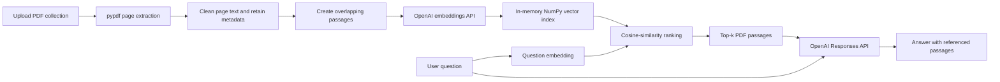

# SourceLens

**Ask questions across a collection of PDFs.**

SourceLens is a Streamlit application for exploring multiple PDF documents through a conversational interface. It extracts readable text page by page, splits the text into overlapping passages, generates OpenAI embeddings, stores the vectors in a local in-memory NumPy index, retrieves the passages most relevant to a question, and displays the source document and page number beneath each answer.


## Features

- Upload and index multiple PDF files in one browser session.
- Preserve source filenames and page numbers while processing documents.
- Search document passages with OpenAI embeddings and cosine similarity.
- Generate answers from the retrieved PDF context through the OpenAI Responses API.
- Inspect ranked referenced passages beneath each response.
- Start a new conversation without rebuilding the collection.
- Remove the active collection and clear its in-memory index.
- Handle missing API keys, blank questions, damaged files, encrypted PDFs, blank pages, and image-only scans with clear messages.
- Run automated tests without sending live OpenAI API requests.

## Technology stack

Python - Used for building the core applciation logic and backend workflow

Streamlit - Used for creating the browser interface and handling session state

pypdf - Used for extracting text from uploaded PDF pages

OpenAI Python SDK - Used for embedding generation and response generation through OpenAI APIs

NumPy - Used for local vector storage and cosine similairty ranking

python-dotenv - Used for loading enviornment variables from the .env file

pytest - Used for automated unit testing and validation

## How the application works

1. The user uploads one or more PDF files in the sidebar.
2. SourceLens reads each document with `pypdf` and retains the source filename and page number for every readable page.
3. Page text is cleaned and split into overlapping passages. The overlap helps retain context when an idea crosses a chunk boundary.
4. The application requests an embedding for each passage from the OpenAI embeddings endpoint.
5. Normalized passage vectors are stored in memory as a NumPy matrix.
6. When the user asks a question, SourceLens embeds the question and calculates cosine-similarity scores against the stored passage vectors.
7. The top-ranked passages, the question, and a small amount of recent conversation history are sent to the OpenAI Responses API.
8. The interface shows the answer and an expandable list of referenced passages with filenames and page numbers.



## Setup on macOS

### Requirements

- Python 3.11 or higher
- Internet access while installing packages and while using the OpenAI API.
- A valid OpenAI API key.

### Setup

Unzip the project, open Terminal, and move into the extracted folder:

```bash
cd path/to/SourceLens
chmod +x setup_macos.sh run_macos.sh
./setup_macos.sh
```

The setup script creates a virtual environment, installs the runtime and test dependencies, and creates a local `.env` file from `.env.example` when one does not already exist.

Open `.env` and replace the placeholder value:

```text
OPENAI_API_KEY=replace_with_your_openai_api_key
```

Do not commit `.env`. It is already listed in `.gitignore`.

## Run the app

```bash
./run_macos.sh
```

## Use the app

1. Add one or more text-based PDF files in the **PDF Collection** sidebar.
2. Select **Build Document Index**.
3. Confirm that the sidebar lists the indexed document names, readable pages, and searchable passages.
4. Ask a question in the chat input.
5. Expand **Referenced passages** under an answer to inspect the retrieved evidence.
6. Use **Start New Conversation** to clear messages while keeping the active collection.
7. Use **Remove Collection** to discard the in-memory index and uploaded-file selection.

## Limitations

- The vector index is held in memory and is discarded when the Streamlit session ends.
- Image-only scanned PDFs require OCR and are reported as non-extractable in this version.

